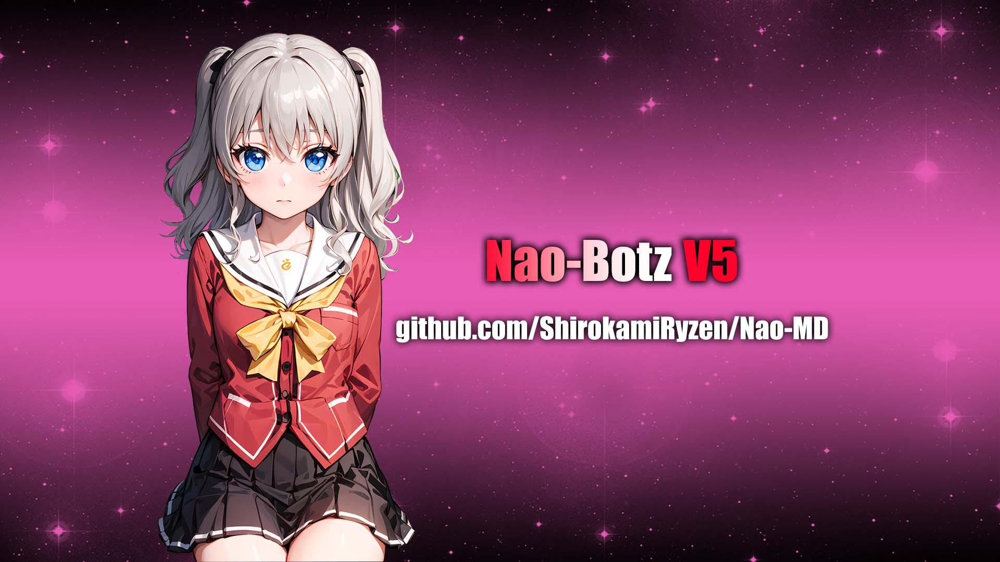

<p align="center">
    
</p>
<h1 align="center">Nao-Botz V5</h1>


## NOTE BEFORE USING!!
- Edit all Owner Information on config.js
- If the feature not working, just buy your own API key
---------
- Ubah semua Informasi Owner di config.js
- Jika sebagian fitur ada yang tidak berfungsi, beli API key lu sendiri

## EXTRA FILE FOR REPLIT OR DOCKER USER
[DOWNLOAD](https://cloud.ryzendesu.com/api/raw/?path=/Extra%20Bot%20File.zip)

### a little about this bot
- ✔️ | **Simple** 
- ✔️ | **No Button** 
- ✔️ | **Multi Device** 
- ✔️ | **Plugins** 
- ✔️ | **99% Scrape Feature** 
---------
### Some of the features include
- ✔️ | Menfess
- ✔️ | AntiCall
- ✔️ | Welcome & Leave
- ✔️ | AI Feature (ChatGPT/DALL-E/MidJourney/To Anime)
- ✔️ | Sticker 
- ✔️ | Downloader 
- ✔️ | Quotes
- ✔️ | Anime 
- ✔️ | Premium 
- ✔️ | Tools 
---------

##
[](https://api.whatsapp.com/send/?phone=6285864034767&text=.menu) 
[](https://wa.me/6285174269046) 

##
[](https://app.netlify.com/sites/nao-md/deploys)
<a></a>
---------

## ```Heroku Buildpack```
[](https://heroku.com/deploy?template=https://github.com/ShirokamiRyzen/Nao-MD)

| BuildPack | LINK |
|--------|--------|
| **FFMPEG** |[here](https://github.com/jonathanong/heroku-buildpack-ffmpeg-latest) |
| **IMAGEMAGICK** | [here](https://github.com/DuckyTeam/heroku-buildpack-imagemagick) |

## TERMUX USER
```bash
$ pkg upgrade && pkg update
$ pkg install git -y
$ pkg install nodejs -y
$ pkg install ffmpeg -y
$ pkg install imagemagick -y
$ git clone https://github.com/ShirokamiRyzen/Nao-MD
$ cd Nao-MD
$ npm i
```
If error try using yarn instead of npm, see [here](https://github.com/Jikarinka/Kannabotv2#if-npm-install-failed--try--using-yarn-instead-of-npm)
```bash
$ node .
```

#### If npm install failed, try using yarn instead of npm
```bash
$ pkg install yarn -y
$ yarn install
```
---------

## TERMUX WITH UBUNTU

```bash
apt update && apt full-upgrade
apt install wget curl git proot-distro
proot-distro install ubuntu
echo "proot-distro login ubuntu" > $PREFIX/bin/ubuntu
ubuntu
```
---------

[ INSTALLING REQUIRED PACKAGES ]

```bash
ubuntu
apt update && apt full-upgrade
apt install wget curl git ffmpeg imagemagick build-essential libcairo2-dev libpango1.0-dev libjpeg-dev libgif-dev librsvg2-dev dbus-x11 ffmpeg2theora ffmpegfs ffmpegthumbnailer ffmpegthumbnailer-dbg ffmpegthumbs libavcodec-dev libavcodec-extra libavcodec-extra58 libavdevice-dev libavdevice58 libavfilter-dev libavfilter-extra libavfilter-extra7 libavformat-dev libavformat58 libavifile-0.7-bin libavifile-0.7-common libavifile-0.7c2 libavresample-dev libavresample4 libavutil-dev libavutil56 libpostproc-dev libpostproc55 graphicsmagick graphicsmagick-dbg graphicsmagick-imagemagick-compat graphicsmagick-libmagick-dev-compat groff imagemagick-6.q16hdri imagemagick-common libchart-gnuplot-perl libgraphics-magick-perl libgraphicsmagick++-q16-12 libgraphicsmagick++1-dev
```

---------

[ INSTALLING NODEJS ]

```bash
ubuntu
curl -fsSL https://deb.nodesource.com/setup_current.x | sudo -E bash -
apt install -y nodejs gcc g++ make
git clone https://github.com/ShirokamiRyzen/Nao-MD
cd Nao-MD
npm install
npm update
```

---------

## FOR WINDOWS/VPS/RDP USER 💻

* Download And Install Git [`Click Here`](https://git-scm.com/downloads)
* Download And Install NodeJS [`Click Here`](https://nodejs.org/en/download)
* Download And Install FFmpeg [`Click Here`](https://ffmpeg.org/download.html) (**Don't Forget Add FFmpeg to PATH enviroment variables**)
* Download And Install ImageMagick [`Click Here`](https://imagemagick.org/script/download.php)

```bash
git https://github.com/ShirokamiRyzen/Nao-MD
cd Nao-MD
npm install
npm update
```

---------

## Run 🏃

```bash
node .
```

---------

## ```Arguments node . [--options] [<session name>]```

## `--self`
* activate self mode (ignores other)

## `--pconly`
* If that chat not from private bot, bot will ignore

## `--gconly`
* If that chat not from group, bot will ignore

## `--swonly`
* If that chat not from status, bot will ignore

## `--prefix <prefixes>`
* `prefixes` are seperated by each character
Set prefix

## `--server`
* Used for [heroku](https://heroku.com/) or scan through website

## `--restrict`
* Enables restricted plugins (which can lead your number to be **banned** if used too often)
* Group Administration `add, kick`

## `--img`
* Enable image inspector through terminal

## `--autoread`
* If enabled, all incoming messages will be marked as read

## `--nyimak`
* No bot, just print received messages and add users to database

## `--test`
* **Development** Testing Mode

---------

#
### 📮 S&K
1. Jangan diperjual belikan Script ini
2. Sebelum pakai jangan lupa kasih star
3. Follow Github !
4. Jangan salah gunakan script ini!

---------

### Thanks To
[](https://github.com/Nurutomo)
[](https://github.com/BochilGaming)
[](https://github.com/ImYanXiao)
[](https://github.com/ShirokamiRyzen)
#### Contributor
[](https://github.com/ShirokamiRyzen)

---------